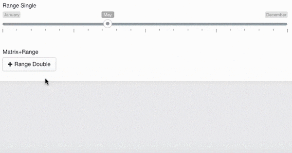

# MX Range Slider plugin for Craft CMS 3.x

Is an easy, flexible and responsive range slider for Craft CMS with tons of options.

## Requirements

This plugin requires Craft CMS 3.0.0-beta.23 or later.

## Installation

1. Install with Composer via `composer require maxlazar/mx-rangeslider-craftcms` from your project directory
2. Install plugin in the Craft Control Panel under Settings > Plugins

You can also install MX Range Slider via the **Plugin Store** in the Craft Control Panel.

## MX Range Slider Overview

## Configuring MX Range Slider

| Option | Data-Attr | Defaults | Type | Description |
| --- | --- | --- | --- | --- |
| `skin` | `data-skin` | `flat` | string | Choose UI skin to use (flat, big, modern, round, sharp, square) |
| `type` | `data-type` | `single` | string | Choose slider type, could be `single` - for one handle, or `double` for two handles |
| `min` | `data-min` | `10` | number | Set slider minimum value |
| `max` | `data-max` | `100` | number | Set slider maximum value |
| `from` | `data-from` | `min` | number | Set start position for left handle (or for single handle) |
| `to` | `data-to` | `max` | number | Set start position for right handle |
| `step` | `data-step` | `1` | number | Set sliders step. Always > 0. Could be fractional |
| `min_interval` | `data-min-interval` | `-` | number | Set minimum diapason between sliders. Only for **double** type |
| `max_interval` | `data-max-interval` | `-` | number | Set minimum maximum between sliders. Only for **double** type |
| `drag_interval` | `data-drag-interval` | `false` | boolean | Allow user to drag whole range. Only for **double** type |
| `values` | `data-values` | `[]` | array | Set up your own array of possible slider values. They could be numbers or strings. If the values array is set up, min, max and step param, can no longer be changed |
| `from_fixed` | `data-from-fixed` | `false` | boolean | Fix position of left (or single) handle |
| `from_min` | `data-from-min` | `min` | number | Set minimum limit for left (or single) handle |
| `from_max` | `data-from-max` | `max` | number | Set maximum limit for left (or single) handle |
| `from_shadow` | `data-from-shadow` | `false` | boolean | Highlight the limits for left handle |
| `to_fixed` | `data-to-fixed` | `false` | boolean | Fix position of right handle |
| `to_min` | `data-to-min` | `min` | number | Set minimum limit for right handle |
| `to_max` | `data-to-max` | `max` | number | Set maximum limit for right handle |
| `to_shadow` | `data-to-shadow` | `false` | boolean | Highlight the right handle |
| `prettify_enabled` | `data-prettify-enabled` | `true` | boolean | Improve readability of long numbers: 10000000 &rarr; 10 000 000 |
| `prettify_separator` | `data-prettify-separator` | ` ` | string | Set up your own separator for long numbers: 10000000 &rarr; 10,000,000 etc. |
| `prettify` | `-` | `null` | function | Set up your own prettify function. Can be anything. For example, you can set up unix time as slider values and than transform them to cool looking dates |
| `force_edges` | `data-force-edges` | `false` | boolean | Sliders handles and tooltips will be always inside it's container |
| `keyboard` | `data-keyboard` | `true` | boolean | Activates keyboard controls. Move left: &larr;, &darr;, A, S. Move right: &rarr;, &uarr;, W, D. |
| `grid` | `data-grid` | `true` | boolean | Enables grid of values above the slider |
| `grid_margin` | `data-grid-margin` | `true` | boolean | Set left and right grid gaps |
| `grid_num` | `data-grid-num` | `4` | number | Number of grid units |
| `grid_snap` | `data-grid-snap` | `false` | boolean | Snap grid to sliders step (step param). If activated, grid_num will not be used. Max steps = 50 |
| `hide_min_max` | `data-hide-min-max` | `false` | boolean | Hides **min** and **max** labels |
| `hide_from_to` | `data-hide-from-to` | `false` | boolean | Hides **from** and **to** labels |
| `prefix` | `data-prefix` | `` | string | Set prefix for values. Will be set up right before the number: **$**100 |
| `postfix` | `data-postfix` | `` | string | Set postfix for values. Will be set up right after the number: 100**k** |
| `max_postfix` | `data-max-postfix` | `` | string | Special postfix, used only for maximum value. Will be showed after handle will reach maximum right position. For example **0 — 100+** |
| `decorate_both` | `data-decorate-both` | `true` | boolean | Used for **double** type and only if prefix or postfix was set up. Determine how to decorate close values. For example: **$10k — $100k** or **$10 — 100k** |
| `values_separator` | `data-decorate-both` | ` - ` | string | Set your own separator for close values. Used for **double** type. Default: **10 — 100**. Or you may set: **10 to 100, 10 + 100, 10 &rarr; 100** etc. |
| `disable` | `data-disable` | `false` | boolean | Locks slider and makes it inactive. Input is disabled too. Invisible to forms |
| `block` | `data-blokc` | `false` | boolean | Locks slider and makes it inactive. Input is NOT disabled. Can be send with forms |
| `extra_classes` | `data-extra-classes` | `—` | string | Traverse extra CSS-classes to sliders container |
| `scope` | `-` | `null` | object | Scope for callbacks. Pass any object |
| `onStart` | `-` | `null` | function | Callback. Is called on slider start. Gets all slider data as a 1st attribute |
| `onChange` | `-` | `null` | function | Callback. IS called on each values change. Gets all slider data as a 1st attribute |
| `onFinish` | `-` | `null` | function | Callback. Is called when user releases handle. Gets all slider data as a 1st attribute |
| `onUpdate` | `-` | `null` | function | Callback. Is called when slider is modified by external methods `update` or `reset` |

## Using the MX Range Slider plugin in your templates

    	from {{ entry.range_field.from }}
    	to {{ entry.range_field.to }}
    	value {{ entry.range_field.value }}

## MX Range Slider Roadmap

* Release it

### License

The MX RangeSlider for CraftCMS CE is open-sourced software licensed under the [MIT license](http://opensource.org/licenses/MIT)

### Thanks To

[Denis Ineshin](https://github.com/IonDen) for [ion.rangeSlider](https://github.com/IonDen/ion.rangeSlider) ([MIT license](http://opensource.org/licenses/MIT))

### And one more thing

Brought to you by [Max Lazar](https://www.wiseupstudio.com)

